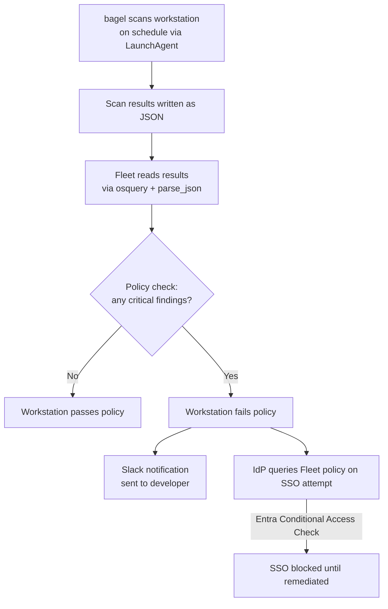

+++
title = "Detecting and removing dangerous secrets on dev workstations before Shai-Hulud does"
date = "2026-05-25"
author = "Guillaume Ross"
description = "Software supply chain malware keeps targeting secrets on developer workstations. In this article I explain how to find workstations carrying dangerous secrets using a combination of Fleet/osquery and bagel."
+++

## Credential theft from developer workstations
**Let's use a combination of open-source tools to detect problematic clear-text secrets on workstations and to ensure they're not so easy for malware/scripts to steal.**

PyPI, npm, VS Code Extensions, OpenVSX, brew and other package managers expand the attack surface on workstations. While companies still lie to themselves that "all code changes are reviewed", millions of developers have code execution access to workstations, and those developers can get compromised by various threat actors. Now that non-technical users run agents which pull the same packages, the issue is spreading to every workstation.

There are many controls we can apply to workstations, but it can be difficult to do so, especially for smaller organizations.

So what do most companies do? It varies but typically goes from *nothing* to *hope our endpoint security tools block this*.

## How can we make this better with open-source tools?
The solution is straightforward, but requires a few tools:

1. A tool to find secrets and output results. `bagel`
2. A tool to check results for compliance. `fleet + osquery`
3. Integration to tools like Slack and Identity Providers. `fleet`

The high-level workflow looks like this:



### Bagel

An open-source tool by Boost Security, [bagel](https://github.com/boostsecurityio/bagel) scans a user's home directory for secrets commonly used by developers. It is configurable, with probes for SSH keys, GitHub credentials, cloud provider credentials, and more. It outputs JSON, and includes the severity and location of each finding, but of course does not log the actual secrets. Bagel, written in Go, is fast and focused, looking for secrets in the same places where malware usually does. Think of it as an analogue of `trufflehog`, but for workstations instead of repos.

As it is a command-line tool, it can easily be scheduled with a LaunchAgent, and as its output is JSON, it is easy to integrate with other tools to build a solution instead of just telling developers to "run `bagel` and clean up".

### Fleet

[Fleet](https://github.com/fleetdm/fleet) is an open-source platform for IT and security, which uses [osquery](https://osquery.io) for telemetry. Think of it as an MDM (mobile device management) and osquery server, managed via GitOps (recommended).

Fleet provides the following features that are critical to making our secret scanning more robust than a simple ad-hoc effort:

1. Package deployment.
2. Policy queries, or "checks". These queries are considered to pass if results are returned, and to fail if there are none.
3. A Fleet-specific osquery table for [parsing JSON](https://fleetdm.com/tables/parse_json).
4. An API to integrate third-party tools like IdPs to check on compliance status, as well as webhook notifications to integrate to orchestration tools like [n8n](https://n8n.io), SIEM, etc.

### Fleebag
As a proof of concept, I figured it would be relatively easy to hook these up together.

[Fleebag](https://github.com/GuillaumeRoss/fleebag) (for *fleet-bagel* as I am an expert at naming things) is a simple vibe-coded repository containing the following:

1. [Scripts](https://github.com/GuillaumeRoss/fleebag/blob/main/scripts/build-pkg.sh) to create a macOS installation package of `bagel`, with a LaunchAgent running it on a schedule, outputting logs to a standard destination.
2. A Fleet [query](https://github.com/GuillaumeRoss/fleebag/blob/main/queries/bagel_findings.sql) for all secrets that `bagel` found on each workstation.
3. A Fleet [policy query](https://github.com/GuillaumeRoss/fleebag/blob/main/queries/bagel_policy.sql) that passes if `fleebag` results are fresh and contain no critical findings, which you can tune to your desired severity.
4. An example macOS profile to grant `bagel` full disk access, so you don't have to rely on end users approving security prompts on macOS.

#### Example query
This query is for macOS, as is the rest of `fleebag`, though with `bagel` and `fleet` this can easily be adjusted to other platforms by tweaking paths and swapping `LaunchAgent` files with cron jobs or scheduled tasks.

```sql
WITH findings_base AS (
    -- One group per finding element: parent is exactly 'findings/N'.
    -- NOT LIKE 'findings/%/%' excludes findings/N/metadata, findings/N/locations, etc.
    -- Without this guard those sub-groups produce NULL-filled rows with only a timestamp.
    SELECT
        pj.path,
        pj.parent,
        MAX(CASE WHEN pj.key = 'severity'    THEN pj.value END) AS severity,
        MAX(CASE WHEN pj.key = 'id'          THEN pj.value END) AS rule_id,
        MAX(CASE WHEN pj.key = 'probe'       THEN pj.value END) AS probe,
        MAX(CASE WHEN pj.key = 'path'        THEN pj.value END) AS file_path,
        MAX(CASE WHEN pj.key = 'fingerprint' THEN pj.value END) AS fingerprint,
        MAX(CASE WHEN pj.key = 'title'       THEN pj.value END) AS title
    FROM parse_json pj
    WHERE pj.path LIKE '/Users/%/Library/Logs/fleebag/results.json'
      AND pj.parent LIKE 'findings/%'
      AND pj.parent NOT LIKE 'findings/%/%'
    GROUP BY pj.path, pj.parent
),

finding_metadata AS (
    -- line_number lives at findings[N].metadata.line_number, not findings[N].line
    SELECT
        pj.path,
        SUBSTR(pj.parent, 1, LENGTH(pj.parent) - LENGTH('/metadata')) AS parent,
        MAX(CASE WHEN pj.key = 'line_number' THEN pj.value END)       AS line_number
    FROM parse_json pj
    WHERE pj.path LIKE '/Users/%/Library/Logs/fleebag/results.json'
      AND pj.parent LIKE 'findings/%/metadata'
    GROUP BY pj.path, pj.parent
),

finding_locations AS (
    -- locations[] is optional; present when the same secret appears in multiple places
    SELECT
        pj.path,
        SUBSTR(pj.parent, 1, LENGTH(pj.parent) - LENGTH('/locations')) AS parent,
        GROUP_CONCAT(pj.value, ', ')                                    AS locations
    FROM parse_json pj
    WHERE pj.path LIKE '/Users/%/Library/Logs/fleebag/results.json'
      AND pj.parent LIKE 'findings/%/locations'
    GROUP BY pj.path, pj.parent
)

SELECT
    REPLACE(REPLACE(fb.path, '/Library/Logs/fleebag/results.json', ''), '/Users/', '') AS username,
    fb.severity,
    fb.rule_id,
    fb.probe,
    fb.file_path,
    m.line_number,
    l.locations,
    fb.title,
    fb.fingerprint,
    datetime(f.mtime, 'unixepoch') AS last_scan
FROM findings_base fb
LEFT JOIN finding_metadata  m ON m.path = fb.path AND m.parent = fb.parent
LEFT JOIN finding_locations l ON l.path = fb.path AND l.parent = fb.parent
LEFT JOIN file f ON f.path = fb.path

ORDER BY
    CASE fb.severity
        WHEN 'critical' THEN 1
        WHEN 'high'     THEN 2
        WHEN 'medium'   THEN 3
        WHEN 'low'      THEN 4
        ELSE                 5
    END,
    fb.path;
```
#### Policy query
The [policy query](https://github.com/GuillaumeRoss/fleebag/blob/main/queries/bagel_policy.sql) is essentially a modified version of the previous query, that will return `1` if the file is fresh and does NOT contain critical findings. Adjust it to your tolerance by changing `critical` to `high`, for example.

## What is missing

0. This is hastily put together just as a proof of concept, to allow sharing of this idea. `bagel`, `fleet` and `osquery` are serious projects. This *glue* repo is not.
1. Lack of signatures and notarization.
    1. `bagel` itself is ad-hoc signed. Before deploying any of this at scale, I would recommend reviewing it and signing your own build.
    2. You should do the same for the `.pkg` you generate for MDM distribution.
2. The MDM profile for full-disk access is essentially a placeholder, you likely have existing similar profiles for security tooling, and should add the right identity for your signed version of `bagel` to those.
3. Unlike a [fully packaged solution](https://boostsecurity.io/solution/developer-endpoint), this only scans for secrets. It has no concept of what packages are installed, or if those secrets could already have been exposed.  
4. You'll need to hook the Fleet policy up to your IdP. For example, if you use Entra, you can leverage [Conditional Access](https://fleetdm.com/guides/entra-conditional-access-integration).
5. An alternate place where to store secrets. There are many options for this, from tools like [1Password developer tools](https://1password.com/developer-security) to [Yubikeys for SSH and GPG](https://github.com/drduh/yubikey-guide) depending on your risk tolerance. 
6. Some tools make it extremely hard not to have secrets in readable files. Security tools like [Phorion](https://phorion.io/blog/detecting-and-preventing-npm-supply-chain-attacks-with-phorion-protections/) and [Northpole Security's Santa](https://northpole.security/features/file-access-authorization.html) that can authorize only legit applications to access these files are extremely useful.
7. Nothing here actually removes the secrets, it can be used to tell the developer to remove them and to block their workstations from logging in as an incentive. You could be more aggressive and clean-up the secrets with a script as well, but be careful with anything that destroys data.

## Let's do this
We can all secure our own environments more and reduce the impact these industry-wide attacks are currently having.

We have been lucky the impact has been limited so far. The true reach of these attacks is potentially catastrophic, and as more attackers become familiar with these methods, damaging attacks will keep happening.

On top of securing build pipelines, applications and their dependencies, we need to realize that endpoint security is still important. The so-called basics and fundamentals change. While we have known for a while that keeping clear-text secrets on disk was a bad idea, it was not until the widespread infostealer epidemic that it became an absolute must. Due to the way these attacks spread, even if only some of us who have write access to popular open-source projects start securing developer workstations better, we can have a significant impact.

Stop waiting for your EPP/EDR to save you, and put your MDM, scripts and IdPs to good use!


